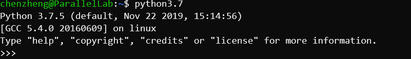

##### 非root用户如何在Linux服务器上安装python3

---

##### 一、去官网下载一个python3安装包

https://www.python.org/ftp/python/3.7.5/Python-3.7.5.tgz

##### 二、

解压

```shell
tar zxvf Python-3.7.5.tgz
```

创建一个python3.7的文件夹,以备安装用

```sh
mkdir python3.7
```

安装，指定刚刚创建的文件夹为安装位置

```shell
./configure --prefix="/home/chenzheng/python3.7"
make
make install
```

添加环境变量

```shell
vim ~/.bashrc
export PATH=$PATH:/home/chenzheng/python3.7/bin  #添加这一行
source ~/.bashrc
```

输入python3.7

```shell
python3.7
```



大功告成啦！

##### 三、发现用这种方式安装的时候会又很多依赖库没有的问题

使用Anaconda安装

先去官网下载一个Anaconda的python3.7 https://www.anaconda.com/distribution/ 


下载到服务器上解压

运行

```shell
bash Anaconda3-2019.10-Linux-x86_64.sh
```

接下来一直按Enter就可以啦！

最后需要指定安装位置，选择想要的位置安装就行了

如果当前环境里已经有python了，运行python可能不是刚刚安装的那个版本

此时需要为刚刚安装的python创建一个别名，比如

```shell
cp python python3.7
```

再把python3.7所在的位置添加到环境变量就可以啦

```shell
vim ~/.bashrc
export PATH=$PATH:/Your path/bin
source ~/.bashrc
```

ok啦